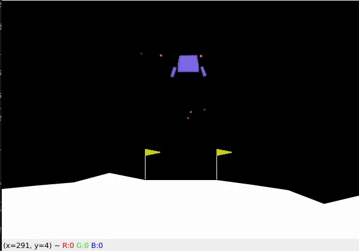
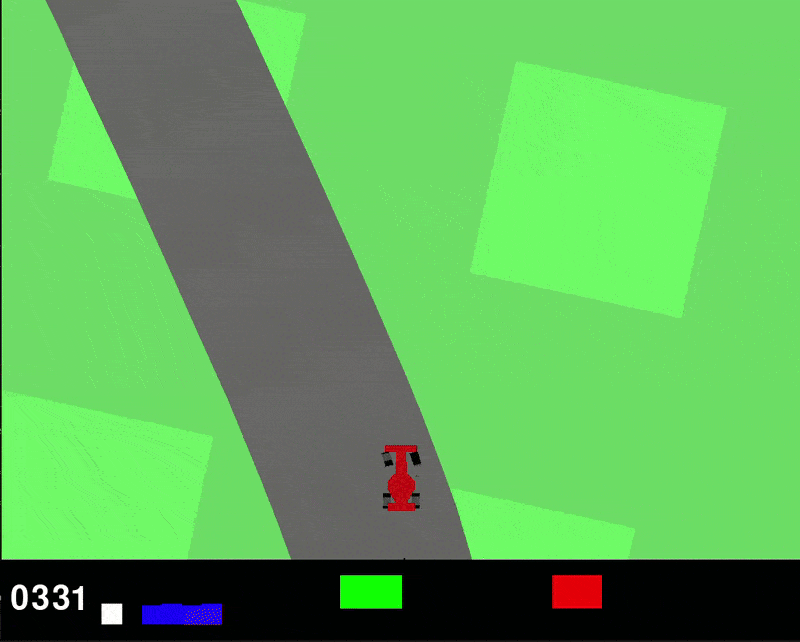

# Hybrid Reinforcement Learning with Expert Initialization

This project explores the combination of Behavior Cloning (BC) and Proximal Policy Optimization (PPO) to improve sample efficiency and training stability in reinforcement learning tasks.

## Overview

Reinforcement learning (RL) algorithms often suffer from poor sample efficiency and high sensitivity to hyperparameters. This project implements a hybrid approach where PPO is initialized with a policy pretrained via BC, aiming to:

- Improve sample efficiency
- Enhance training stability
- Enable faster convergence

## Environments Tested

We evaluate the methods on three OpenAI Gym environments:

---

### CartPole-v1

#### PPO


#### Behavior Cloning (BC)


#### BC + PPO


---

### LunarLander-v2

#### PPO


#### Behavior Cloning (BC)


#### BC + PPO


---

### CarRacing-v2

#### PPO


#### Behavior Cloning (BC)


#### BC + PPO


---

## 📈 Results Summary

| Environment       | Method     | Samples Required | Warm-up Steps | Avg Reward/Episode |
|------------------|------------|------------------|----------------|---------------------|
| **CartPole-v1**   | PPO        | 25k              | -              | 500                 |
|                  | BC         | 1k               | -              | 463                 |
|                  | BC + PPO   | 10k              | 1k             | 500                 |
| **LunarLander-v2**| PPO        | 200k             | -              | 175                 |
|                  | BC         | 5k               | -              | 143                 |
|                  | BC + PPO   | 20k              | 10k            | 171                 |
| **CarRacing-v2**  | PPO        | 1000k            | -              | 683                 |
|                  | BC         | 10k              | -              | 618                 |
|                  | BC + PPO   | 200k             | 50k            | 710                 |


---

## ⚙️ Hyperparameter Sensitivity

| Environment       | Method     | Learning Rate Sensitivity | Batch Size Sensitivity | Clip Range Sensitivity |
|------------------|------------|----------------------------|-------------------------|-------------------------|
| **CartPole-v1**   | PPO        | Low                        | Low                     | Low                     |
|                  | BC         | Low                        | Low                     | N/A                     |
|                  | BC + PPO   | Low                        | Low                     | Low                     |
| **LunarLander-v2**| PPO        | Moderate                   | Moderate                | Moderate                |
|                  | BC         | Low                        | Moderate                | N/A                     |
|                  | BC + PPO   | High                       | Moderate                | High                    |
| **CarRacing-v2**  | PPO        | High                       | High                    | Moderate                |
|                  | BC         | Low                        | Low                     | N/A                     |
|                  | BC + PPO   | High                       | Moderate                | High                    |

## Dependencies

- Python 3.8+
- `torch`
- `gym`
- `numpy`
- `matplotlib`

Install dependencies via:

```bash
conda env create -n my_env -f environment.yml
